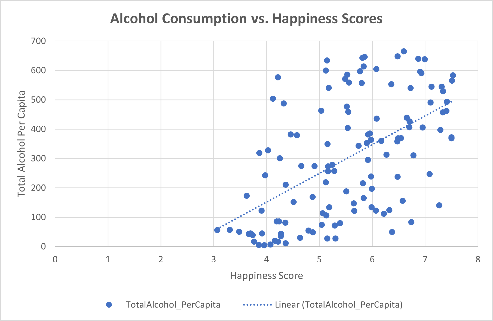

# Alcohol and Happiness Correlation Analysis

## Table of Contents
1. [Introduction](#introduction)
2. [Data Sources](#data-sources)
3. [Tools Used](#tools-used)
4. [Descriptive Statistics](#descriptive-statistics)
5. [Correlation Analysis](#correlation-analysis)
6. [Regression Analysis](#regression-analysis)
7. [Visualization](#visualization)
8. [Statistical Significance](#statistical-significance)
9. [Conclusions](#conclusions)
10. [Future Work](#future-work)
11. [Contact Information](#contact-information)
12. [License](#license)

## Introduction
This project explores the potential correlation between alcohol consumption and happiness across different countries. The primary objectives are to uncover any significant relationships between these variables and understand their implications. Key questions include:
- Is there a significant correlation between alcohol consumption and happiness?
- What can the relationship between alcohol consumption and happiness reveal about societal trends?

## Data Sources
The dataset utilized for this project originates from the [Kaggle Dataset: Happiness and Alcohol Consumption](https://www.kaggle.com/datasets/marcospessotto/happiness-and-alcohol-consumption). It comprises metrics like:
- Happiness Score
- Beer, Spirit, and Wine consumption per capita
- Economic factors like GDP per capita
Data preprocessing involved handling missing values, data type conversion, and outlier detection to prepare the dataset for analysis.

## Tools Used
- Microsoft Excel: Employed for data cleaning, analysis, and visualization.

## Descriptive Statistics
The descriptive statistics revealed the central tendency and dispersion within the data. For instance:
- Mean alcohol consumption: 300.76
- Median happiness score: 5.54
- Standard deviation of happiness score: 1.14
These statistics provide a preliminary understanding of data distribution and central values.

## Correlation Analysis
The correlation coefficient of 0.547 indicates a moderate positive relationship between alcohol consumption and happiness scores, suggesting as one variable increases, so does the other, although not strongly.

## Regression Analysis
The regression analysis yielded an R-Squared value of 0.29, implying 29% of happiness score variance can be explained by alcohol consumption. The p-value (< 0.05) confirms statistical significance, supporting the validity of the findings.

## Visualization
Visualizations, like the scatter plot, visually represent the correlation, and a trend line shows a modest upward trend as alcohol consumption increases. (Include images by uploading them to your repository and linking them in your markdown).

## Statistical Significance
The p-value of close to 0 indicates the correlation is statistically significant, reducing the likelihood that the observed relationship is due to random chance.

## Conclusions
The analysis reveals a moderate positive correlation between alcohol consumption and happiness, albeit not a very strong one. This suggests other factors also significantly impact happiness scores. The findings could spark further research into the multifaceted nature of happiness and the role societal norms around alcohol consumption play in it.

## Future Work
- Explore other potential variables that might influence happiness.
- Conduct a temporal analysis to examine trends over time.
- Delve into a more granular analysis by segmenting data based on region, economic status, or other relevant categories.

## Contact Information
For any queries or discussions related to this project, feel free to reach out:

- Email: caynerc@gmail.com
- LinkedIn: [Cayner Curitana](https://linkedin.com/in/caynercuritana)

## License
This project is licensed under the MIT License - see the [LICENSE.md](LICENSE.md) file for details.
